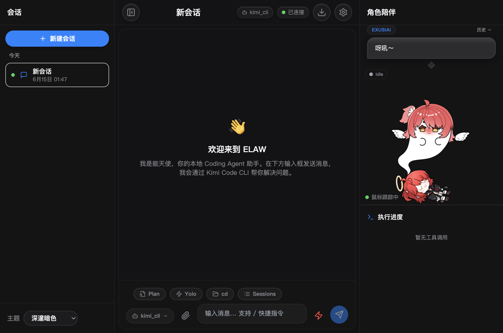
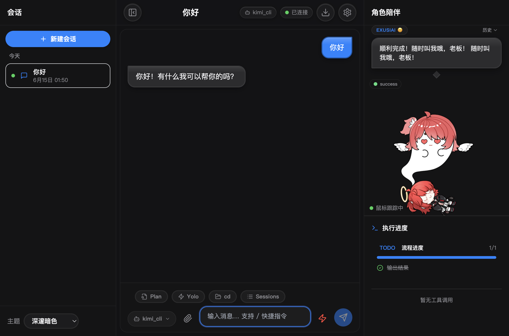
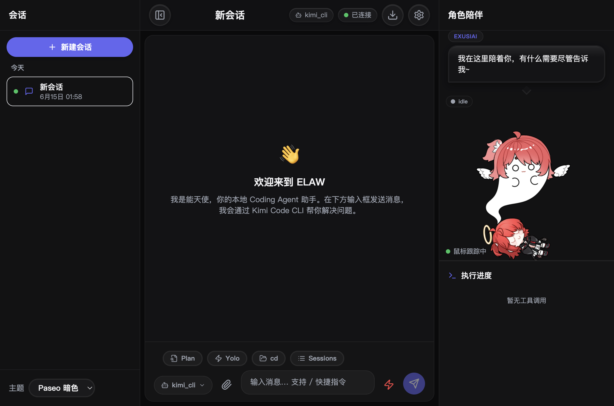

# ELAW - Exusiai Live Agent WebUI

ELAW（代号“苹果派”）是一个带 **Live2D 角色陪伴** 的浏览器端 Coding Agent 交互界面。它通过 WebSocket 连接本地 FastAPI 后端，后端再调用 [Kimi Code CLI](https://kimi.com/kimicode) 等 Coding Agent。项目已从旧版 `acp-qq-bridge` 的 QQ 消息桥接，升级为**浏览器 + 局域网 WebSocket + 角色陪伴**架构。

> 现在你的 Agent 不仅会写代码，还会有表情、会看你鼠标、会陪你聊天。

---

## 使用截图

### 桌面端主界面（Live2D 角色陪伴 + 会话区 + 执行进度）



### 聊天后角色进入「success」状态，显示爱心眼表情与台词



### 局域网域名访问，手机/平板可连同一个 Wi-Fi 直接打开



---

## 核心特性

- 🎭 **Live2D 角色陪伴**：接入 pixi-live2d-display + Cubism 4，角色会跟随鼠标、点击头部/身体触发不同台词与表情。
- 😊 **情绪引擎**：后端根据 Agent 执行状态（thinking / executing / success / error）自动映射角色情绪与 Live2D 表情/动作。
- 💬 **角色台词气泡**：Agent 执行过程中，Exusiai 会在右侧实时说出台词，并显示对应情绪 emoji。
- 🌐 **浏览器聊天界面**：React 18 + TypeScript + Tailwind CSS，支持响应式桌面/移动端。
- 🔌 **Kimi Code CLI 优先连接**：已实现 Kimi CLI 适配器，使用 `stream-json` 输出格式。
- 🧩 **多 Agent 兼容**：后端 `IAgentAdapter` 接口已预留 Claude CLI、OpenAI CLI 等扩展点。
- 🎨 **可更换配色方案**：主题完全由 `backend/config/themes/*.yaml` 驱动，切换无需重新编译。
- ⚡ **实时流式反馈**：Agent 执行状态与回复在同一消息气泡内流式更新。
- 🛑 **打断机制**：前端发送 `interrupt`，后端终止当前 CLI 进程。
- 💬 **选项交互**：Plan Mode 选项以按钮/下拉框/卡片形式渲染。
- 📱 **PWA 基础**：已配置 manifest 与 Service Worker（Node 20+ 启用完整 PWA）。
- 💾 **会话持久化**：基于 SQLite 的会话历史存储。
- 🏠 **局域网访问**：前后端均支持监听 `0.0.0.0`，手机连同一 Wi-Fi 即可通过域名/IP 访问。

---

## 技术栈

- **前端**：React 18, TypeScript, Vite, Tailwind CSS, Zustand, Framer Motion, react-markdown
- **Live2D**：PixiJS, pixi-live2d-display, Live2D Cubism 4
- **后端**：Python 3.10+, FastAPI, uvicorn, pydantic, aiosqlite, structlog
- **CLI 桥接**：Kimi Code CLI（`kimi -p ... --output-format stream-json`）

---

## 目录结构

```
.
├── backend/
│   ├── elaw_server/          # FastAPI 后端
│   │   ├── agent_adapters/   # Agent 适配器接口与 Kimi CLI 实现
│   │   ├── session/          # 会话管理与 SQLite 持久化
│   │   ├── websocket/        # WebSocket 连接与消息路由
│   │   ├── persona/          # 角色配置加载与陪伴引擎
│   │   ├── main.py           # FastAPI 入口
│   │   ├── models.py         # WebSocket 协议模型
│   │   └── config.py         # 配置加载
│   ├── config/
│   │   ├── server.yaml       # 服务端配置
│   │   ├── themes/           # 主题配置
│   │   └── personas/         # 角色配置（含 companion 陪伴设置）
│   └── requirements.txt
├── frontend/
│   ├── src/                  # React 源码
│   ├── public/               # 静态资源与 Live2D 模型
│   ├── package.json
│   ├── vite.config.ts
│   └── tailwind.config.js
├── docs/
│   └── screenshots/          # 使用截图
├── report2_new_project_prompt.md
├── report3_tech_stack.tex
└── README.md
```

---

## 快速开始

### 1. 环境要求

- Python 3.10+
- Node.js 18+（推荐 Node 20+ 以获得完整 PWA 支持）
- 已安装并登录 [Kimi Code CLI](https://kimi.com/kimicode)

### 2. 安装后端依赖

```bash
cd backend
python3 -m venv .venv
source .venv/bin/activate  # Windows: .venv\Scripts\activate
pip install -r requirements.txt
```

### 3. 安装前端依赖并构建

```bash
cd frontend
npm install
npm run build
```

### 4. 配置

编辑 `backend/config/server.yaml`：

```yaml
agent_adapter:
  default: "kimi_cli"
  adapters:
    kimi_cli:
      type: "kimi_code_cli"
      command: "kimi"
      output_format: "stream-json"
      working_dir: "/Users/fuyuuku/projects"  # 修改为你的工作目录
```

### 5. 启动服务

```bash
# 后端（监听所有网卡，方便局域网访问）
cd backend
.venv/bin/uvicorn elaw_server.main:app --host 0.0.0.0 --port 8765

# 前端（开发模式，同时监听所有网卡）
cd frontend
npm run dev -- --host 0.0.0.0
```

### 6. 访问

- 本机：http://localhost:5173
- 局域网内其他设备：
  - 域名：`http://<本机IP>.nip.io:5173`
  - 直接 IP：`http://<本机IP>:5173`

> 前端会代理 `/ws` 和 `/api` 到后端，因此手机上只需打开前端地址即可使用全部功能。

---

## 开发模式

若只开发前端，可使用 Vite 代理到后端：

```bash
cd frontend
npm run dev
```

前端将运行在 http://localhost:5173，并自动代理 `/ws` 和 `/api` 到后端的 8765 端口。

---

## 主题定制

在 `backend/config/themes/` 下新增 YAML 文件即可被自动识别。主题格式示例见 `exusiai_default.yaml`。切换主题无需重新编译前端。

---

## 角色陪伴配置

角色陪伴行为由 `backend/config/personas/exusiai.yaml` 中的 `companion` 区块控制：

```yaml
companion:
  status_to_emotion:
    thinking: neutral
    executing: confident
    success: happy
    error: worried
  live2d:
    expressions:
      happy: "爱心眼"
      worried: "哭哭"
    motions:
      idle: "Idle"
  touch_zones:
    head: { expression: "？", lines: ["老板？", "看这里～"] }
    body: { expression: "脸红", lines: ["嘿嘿～", "呀吼～"] }
```

修改后刷新页面即可生效，无需重启后端。

---

## 后续扩展

- 🔊 **TTS**：接入 edge-tts 等语音合成，让角色开口说话
- 🧠 **情绪引擎增强**：LLM / Embedding / Keyword 三层级联分析
- 🤖 **多 Agent**：实现 `IAgentAdapter` 即可接入 Claude CLI、OpenAI CLI 等
- 📲 **移动端优化**：针对触屏优化 Live2D 点击区域与布局

---

## 许可证

MIT
